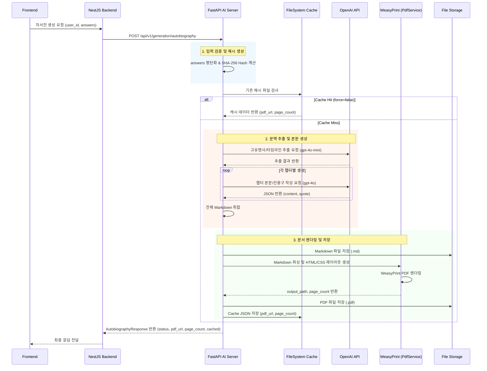

# 자서전 생성 알고리즘 및 PDF 변환 흐름 보고서

본 문서는 FastAPI AI 서버의 핵심 기능인 **자서전 생성(Autobiography Generation) 알고리즘**과 **PDF 생성 흐름**을 상세히 분석하여 정리한 문서입니다. 백엔드 연동 및 시스템 파악을 위한 보고서로 활용할 수 있습니다.

---

## 1. 시작 Endpoint

- **Endpoint**: `POST /api/v1/generation/autobiography`
  - *참고: 실제 AI 처리를 담당하는 `generation` 모듈의 라우터 기준입니다. (`proxy.py`의 `POST /autobiography`는 현재 더미 데이터를 반환하도록 구현되어 있습니다.)*

---

## 2. 입력 데이터 구조 (Request Body)

백엔드에서 AI 서버로 전달되는 파라미터 구조입니다 (`AutobiographyRequest` 스키마 기준).

```json
{
  "user_id": "user123",            // 사용자 고유 식별자 (필수)
  "user_name": "홍길동",            // 사용자 이름 (기본값: "사용자")
  "force": false,                  // 강제 재생성 여부 (true일 경우 캐시 무시)
  
  // 데이터 전달 방식 1: 단일 배열 형태
  "answers": [
    {
      "toc_id": 1,
      "question": "가장 기억에 남는 어린 시절은?",
      "answer": "동네 친구들과 뛰놀던 골목길..."
    }
  ],

  // 데이터 전달 방식 2: 챕터별 구조 (내부적으로 answers 형식으로 평탄화됨)
  "chapters": [
    {
      "toc_id": 1,
      "questions": [
         { "question_id": 101, "question": "...", "answer": "..." }
      ]
    }
  ]
}
```

---

## 3. 알고리즘 처리 단계

AI 자서전 생성은 **입력/캐시 검증 → 데이터 추출/구조화 → AI 텍스트 생성 → PDF 변환 → 결과 저장**의 파이프라인으로 동작합니다.

### 단계 1: 입력 검증 및 평탄화
1. `user_id` 누락 시 400 에러를 반환합니다.
2. `chapters` 데이터만 들어왔을 경우, 내부 로직을 통해 챕터들을 순회하며 `answers` 형태의 단일 리스트로 평탄화(Flatten) 작업을 수행합니다.
3. `answers` 데이터가 최종적으로 비어있을 경우 400 에러를 반환하고 중단합니다.

### 단계 2: 해시 생성 및 캐싱 전략 (Cache Validation)
1. `answers` 객체를 직렬화하여 **SHA-256 Content Hash**를 생성합니다.
2. `force=false`이고 해당 해시의 캐시 JSON 파일과 PDF 파일이 이미 존재하면, OpenAI 연산을 생략하고 즉시 캐시된 `pdf_url`과 `page_count`를 반환합니다.

### 단계 3: 답변 정리 및 컨텍스트 추출 (Context Extraction)
- `extract_context_from_answers` 함수를 통해 배열 내의 질문(Q)과 답변(A)을 파싱하여 하나의 긴 문맥(Context) 텍스트로 결합합니다.

### 단계 4: 고유명사 및 타임라인 추출 (Pre-processing)
1. **고유명사 추출**: `gpt-4o-mini`를 사용하여 전체 문맥에서 인물(people), 장소(places), 활동(activities) 등을 담은 `personal_details` JSON을 추출합니다. (본문 생성 시 구체성을 높이는 재료로 활용됨)
2. **타임라인 구성**: `timeline_service`와 `scene_builder`를 통해 답변을 생애 주기(Childhood, School, Youth 등)별 씬(Scene) 구조와 챕터 데이터로 재배치합니다.
3. 챕터별 데이터 할당: `group_answers_by_chapter` 함수가 키워드 및 `toc_id`를 기반으로 답변들을 해당 챕터로 분류합니다.

### 단계 5: OpenAI 본문 및 인용구 생성 (LLM Generation)
각 챕터별로 루프를 돌며 `gpt-4o` 모델을 호출합니다.
1. **프롬프트 구성**: 
   - 챕터의 역할(Role), 정서 톤(Tone), 다음 챕터로의 연결(Transition), 추출해둔 `personal_details` 반영을 지시하는 시스템 프롬프트를 조립합니다.
2. **OpenAI 호출**: 
   - JSON 형태로 `content`(마크다운 본문)와 `quote`(챕터 핵심 인용구)를 반환받습니다.
3. **텍스트 통합**: 
   - 반환된 본문에 챕터 제목(`##`)과 메타데이터 주석(`<!-- MOOD: ... -->`, `<!-- QUOTE: ... -->`)을 포함하여 하나의 거대한 마크다운(Markdown) 문자열을 완성합니다.

### 단계 6: PDF 변환 (Pagination & Rendering)
1. **Markdown 파싱**: `PdfService.parse_markdown_content`가 마크다운을 챕터, 단락, 무드, 인용구 단위 구조로 분해합니다.
2. **Spread 페이지네이션**: `paginate_to_spreads` 함수가 텍스트 길이를 계산하여 좌우 스프레드 단위(T1, T2, T5, T7, T8 템플릿)로 레이아웃을 자동 배치합니다.
3. **HTML → PDF 변환**: `WeasyPrint` 라이브러리와 Jinja2 HTML 템플릿을 사용하여 A4 변형 사이즈(304x225mm)의 프리미엄 PDF 문서로 렌더링합니다.

### 단계 7: 생성물 저장 및 결과 반환
1. **Markdown 저장**: `storage/data/autobiography_{user_id}_{content_hash}.md`
2. **PDF 저장**: `generated_pdfs/autobiography_{user_id}_{content_hash}.pdf`
3. **Cache 저장**: `.cache/autobiography/{content_hash}.json` (안에 `pdf_url`, `page_count` 기록)
4. 응답(Response)으로 `AutobiographyResponse` 객체를 반환합니다.

---

## 4. 파일 저장 구조

자서전 생성 완료 시 다음과 같은 디렉토리와 파일들이 생성됩니다.

- **작업 디렉토리**:
  - 마크다운 본문: `/storage/data/`
  - PDF 결과물: `/generated_pdfs/`
  - 캐시 파일: `/.cache/autobiography/`
- **파일명 규칙**: 
  - `autobiography_{user_id}_{SHA-256 해시값}.[pdf|md|json]`
- **정적 파일 제공 경로**: 
  - 백엔드/프론트엔드에서는 `GET /generated-pdfs/autobiography_{user_id}_{hash}.pdf` 경로를 통해 다운로드 및 조회가 가능하도록 FastAPI의 `StaticFiles`가 마운트되어 있습니다.

---

## 5. 실패 처리 (Error Handling)

시스템은 단계별로 다양한 오류 상황을 감지하고 안전하게 실패(Fail-safe)를 처리합니다.

1. **빈 데이터 오류 (Bad Request)**
   - 전달된 `answers`나 변환된 `chapters`가 비어있을 경우, 400 Bad Request(`"사용자 답변 데이터가 없습니다..."`) 반환.
2. **OpenAI 오류 매핑**
   - `AuthenticationError` (API Key 문제): **HTTP 401** 반환
   - `PermissionDeniedError` (모델 접근 권한 부족): **HTTP 403** 반환
   - `RateLimitError` (할당량, 빈도 제한 초과): **HTTP 429** 반환
3. **PDF 생성 및 파일 시스템 오류**
   - WeasyPrint 변환 실패, 파일 쓰기 권한 부족 시 **HTTP 500** Internal Server Error로 래핑되어 예외를 반환.
4. **Timeout 고려사항**
   - `gpt-4o`를 챕터별로 여러 번 호출하고 렌더링하기 때문에 처리 시간이 깁니다(수십 초 이상 소요). 클라이언트(NestJS 등) 측에서 **충분한 Timeout 설정(예: 60초~120초)**이 필수적입니다.

---

## 6. Mermaid Sequence Diagram

다음은 전체 시스템 컴포넌트 간의 생명주기를 나타내는 시퀀스 다이어그램입니다.


