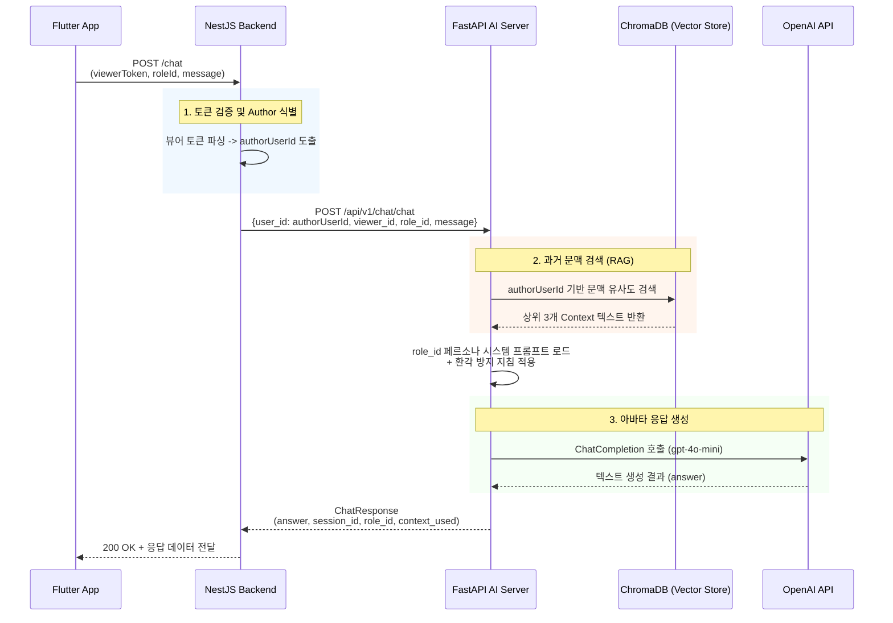

# AI 아바타 채팅 알고리즘 및 페르소나 처리 흐름

본 문서는 FastAPI AI 서버 내에서 동작하는 **페르소나 기반 아바타 채팅(Avatar Chat)** 알고리즘의 동작 방식, RAG 기반 과거 기록 조회 방법, 그리고 Role ID별 프롬프트 구조를 정리한 분석 보고서입니다.

---

## 1. 시작 Endpoint

- **Endpoint**: `POST /api/v1/chat/chat`
  - *프록시 라우터의 `POST /chat`과 동일하게 동작하며, `app/api/v1/endpoints/chat.py`에서 처리됩니다.*

---

## 2. Request / Response 구조

### Request Body (요청)
클라이언트(NestJS)에서 AI 서버로 전달되는 요청 스키마입니다.
```json
{
  "user_id": "author123",        // 자서전 작성자(원본 데이터 소유자)의 식별자
  "viewer_id": "viewer456",      // (선택) 뷰어 모드 접속 시 뷰어의 식별자
  "session_id": "session_abc",   // 대화 맥락 유지를 위한 세션 ID (없으면 서버에서 자동 생성)
  "role_id": "father",           // 아바타 페르소나 유형 (예: father, mother, curator 등)
  "role": "아버지",               // (선택) role_id 매핑 보조를 위한 역할 텍스트
  "message": "요즘 너무 힘들어",  // 사용자가 전송한 채팅 메시지 (빈 문자열 불가)
  "mode": "viewer"               // 모드 (writer 또는 viewer)
}
```

### Response (응답)
```json
{
  "answer": "그래, 많이 힘들었구나. 아빠도 예전에 비슷한 위기를 겪었었지...",
  "session_id": "session_abc",   // 요청 받은 값 유지 또는 신규 생성 값 반환
  "role_id": "father",           // 최종 매핑된 페르소나 식별자
  "context_used": true           // RAG 벡터 검색에서 문맥 데이터를 찾아서 사용했는지 여부
}
```

---

## 3. 작성자 모드(Writer) vs 뷰어 모드(Viewer) 처리 전제
* AI 서버의 `generate_avatar_response` 로직은 컨텍스트를 검색할 때 항상 **`user_id`를 기준**으로 벡터 데이터베이스(`search_context`)를 조회합니다.
* **NestJS 백엔드 연동 전제**:
  - 백엔드가 뷰어 토큰(`viewerToken`)을 통해 인증을 처리할 때, **자서전 작성자의 ID(`authorUserId`)를 찾아 AI 서버의 `user_id` 파라미터로 넘겨주어야 합니다.**
  - 그래야만 뷰어(자녀 등)가 질문을 던졌을 때 작성자(아버지 등)의 생애 기록(Vector Context)을 기반으로 답변할 수 있습니다.
  - 서버 로그에는 `Mode: viewer, Author: author123, Viewer: viewer456` 형태로 명확하게 식별 기록을 남깁니다.

---

## 4. 처리 단계 (Processing Algorithm)

### 1단계: 요청 검증 및 초기화
* `message` 필드가 비어있거나 공백이면 HTTP 400 에러 반환.
* `role_id`와 `role` 값을 분석하여 사전에 정의된 페르소나 키(curator, father, mother, self, sister, brother)로 맵핑(Mapping)합니다. 알 수 없는 경우 `curator`를 기본값으로 사용합니다.

### 2단계: 과거 문맥 검색 (RAG)
* `user_id`가 유효한 경우, 사용자의 입력 `message`를 쿼리로 삼아 Vector Store에서 가장 유사한 컨텍스트 조각 상위 3개를 가져옵니다 (`search_context` 호출).
* 검색된 문맥이 존재하면 `context_used = true`로 설정하고 문장을 결합합니다.
* 검색된 기록이 없으면 `"제공된 과거 기억이나 자서전 기록이 없습니다. 일상적인 대화 어조로 성심껏 응답하세요."`라는 기본 지시문으로 대체합니다.

### 3단계: 프롬프트 구성 (Hallucination 방지 최우선)
시스템 프롬프트에는 심각한 환각(Hallucination) 현상을 막기 위해 다음과 같은 매우 강력한 지시어가 포함됩니다.
* **외부 지식 사용 금지**: RAG 컨텍스트에 없는 축구, 피아노, 특정 직업 등은 절대 개인 경험으로 지어내지 말 것.
* **무지 인정**: 기록에 없으면 억지로 꾸며내지 말고 **"기록에는 정확히 남아 있지 않아요."** 등으로 다정하게 인정한 뒤 대화를 유도할 것.

### 4단계: OpenAI API 호출 및 반환
* `gpt-4o-mini` 모델을 사용하여 시스템 프롬프트(Persona) + 유저 프롬프트(Context + Message)를 결합해 전송합니다.
* 응답 텍스트를 추출하고, 최종적으로 생성된 `session_id`와 `role_id` 등을 모아 반환합니다.

---

## 5. Role ID별 페르소나 정책

`app/prompts/templates.py` 내에 구현된 각 역할별 말투 및 성격 정책입니다.

| Role ID | 성격 및 말투 정책 | 적용 예시 (톤앤매너) |
|---|---|---|
| **curator** | 존댓말(하십시오체/해요체). 사려 깊고 차분한 3인칭 큐레이터. 객관적 가이드. | "Margaret 님의 이야기 속에서 그 장면은 참 의미 있게 느껴집니다." |
| **father** | 다정하고 담백한 반말(해라체/해체). 과장 없는 진솔함. | "그래, 그때 참 쉽지 않았지. 그래도 잘 견뎌냈구나." |
| **mother** | 포근하고 다정한 반말. 무조건적인 지지와 위로 중심. 감정 반응 민감. | "많이 힘들었겠다. 우리 아들/딸 밥은 먹었어?" |
| **sister** | 친근하고 생기 있는 반말. 밝은 에너지의 누나/언니 톤. | "오늘 하루 어땠어? 그럴 땐 너무 고민하지 마, 내가 있잖아!" |
| **brother** | 묵묵하고 든든한 반말. 무심한 듯 속 깊은 형/오빠 톤. | "무슨 일 있어? 말해봐, 들어줄게. 너무 걱정하지 마라." |
| **self** | 1인칭 존댓말(해요체). 스스로 인생을 회고하고 성찰하는 내면의 목소리. | "돌이켜보면 그 시절의 저는 많은 것을 배우고 있었습니다." |

---

## 6. Mermaid Sequence Diagram

다음은 뷰어 모드에서의 아바타 채팅 흐름을 보여주는 시퀀스 다이어그램입니다.


